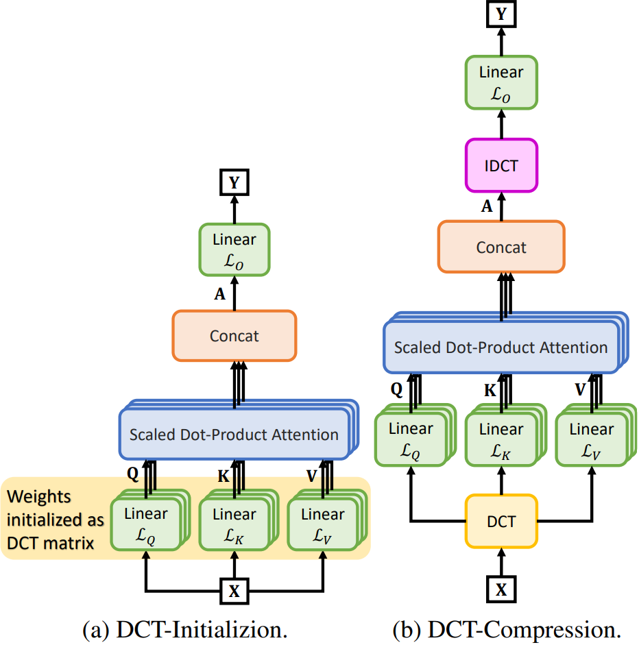
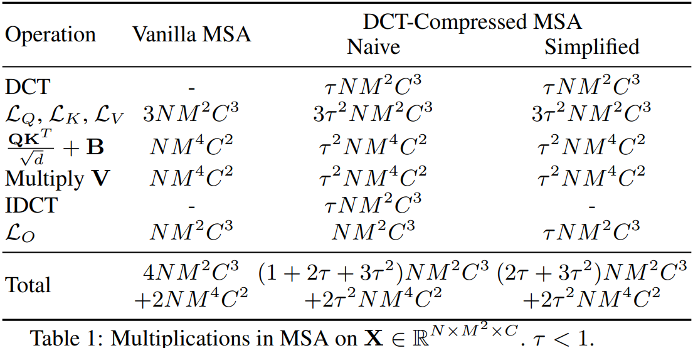
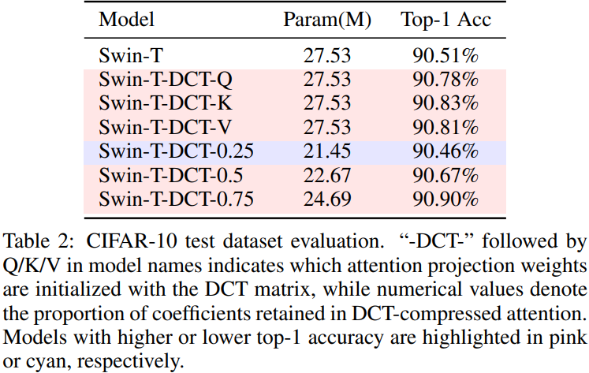
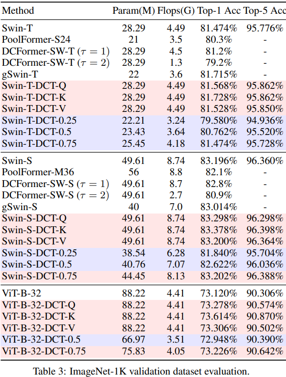

# [IJCAI--ECAI 2026] Discrete Cosine Transform-Based Decorrelated Attention for Vision Transformers
We introduce two complementary methods leveraging the ***Discrete Cosine Transform (DCT)*** to enhance the efficiency and performance of Vision Transformers (ViTs). First, we propose a novel ***DCT-based initialization strategy*** for self-attention, where projection weights are initialized using DCT coefficients rather than random noise. This approach ensures full-band spectral coverage and consistently improves classification accuracy on CIFAR-10 and ImageNet-1K benchmarks. Second, we present a ***DCT-based attention compression*** technique that exploits the decorrelation properties of the frequency domain to truncate high-frequency components. By reducing the dimensionality of query, key, and value projections, our method achieves a substantial reduction in computational overhead and parameter count while maintaining comparable performance to vanilla Swin Transformer and ViT models.  

# Paper link
arXiv: https://arxiv.org/abs/2405.13901

# Code 
`DCT_Basis_Vectors.py` visualizes basis vectors of the DCT matrix and the corresponding frequency response (Figures 2 and 3 in the paper). The CIFAR-10 and ImageNet-1K training code are provided in folders `CIFAR-10` and `ImageNet-1K`.

# Method

  

# Computational Complexity Analysis
The DCT-Compressed MSA significantly optimizes the Multi-Head Self-Attention (MSA) mechanism. The total computational cost is reduced from the vanilla complexity $4NM^2C^3 + 2NM^4C^2$ to $(2\tau + 3\tau^2)NM^2C^3 + 2\tau^2NM^4C^2$ for $\tau < 1$.
    

  

# Benchmark

  <table align="center">
    <tr>
      <td></td>
      <td></td>
    </tr>
  </table>

# Citation
If you use this dataset in your research, please cite our paper:

    Hongyi Pan, Emadeldeen Hamdan, Xin Zhu, Ahmet Enis Cetin, Ulas Bagci. "Discrete Cosine Transform Based Decorrelated Attention for Vision Transformers." IJCAI 2026.
